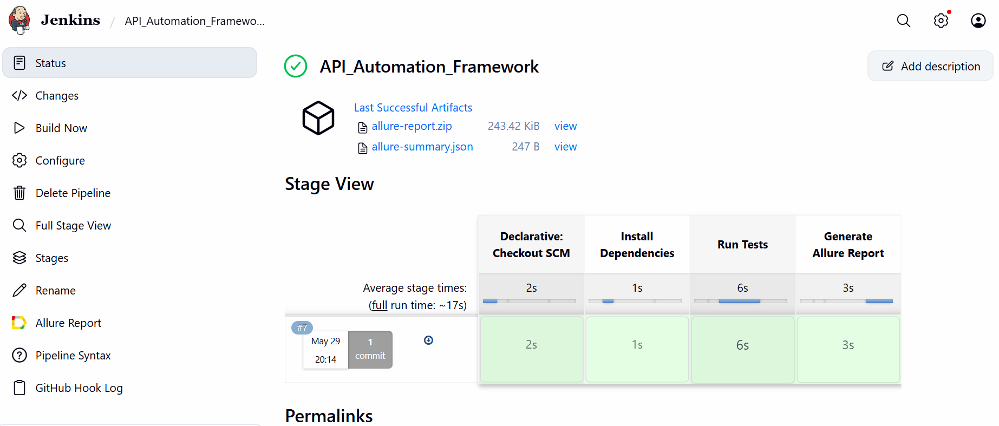
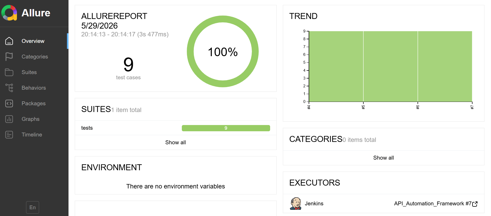

# API Automation Framework

## Overview

This project is a Python-based API Automation Framework developed using Pytest and Requests.

The framework is designed to automate REST API testing by providing a clean, scalable, and reusable structure. It follows industry-standard automation practices such as reusable API methods, custom assertions, logging, test data management, reporting, and CI/CD integration.

The framework validates API functionality, verifies responses, and ensures reliable test execution through automated pipelines.

---

## Project Highlights

* Automated REST API testing using Python and Pytest
* Implemented CRUD API validations
* Built reusable API methods using BaseAPI architecture
* Added custom assertions for response validation
* Implemented logging for test execution tracking
* Used Faker for dynamic test data generation
* Implemented data-driven testing using Pytest parametrization
* Integrated Allure Reporting for execution reports
* Configured Jenkins CI/CD pipeline with GitHub Webhooks
* Maintained source code using Git and GitHub

---

## Technologies Used

| Technology | Purpose                      |
| ---------- | ---------------------------- |
| Python     | Programming Language         |
| Pytest     | Test Automation Framework    |
| Requests   | API Testing                  |
| Faker      | Dynamic Test Data Generation |
| Allure     | Test Reporting               |
| Jenkins    | CI/CD Automation             |
| Git        | Version Control              |
| GitHub     | Source Code Management       |

---

## Project Structure

```text
API_Automation_Framework/
│
├── api/
│   ├── base_api.py
│   └── user_api.py
│
├── data/
│   └── test_data.py
│
├── tests/
│   ├── test_create_user.py
│   ├── test_get_user.py
│   ├── test_update_user.py
│   ├── test_delete_user.py
│   └── test_negative_scenarios.py
│
├── utils/
│   ├── assertions.py
│   ├── config.py
│   ├── fake_data.py
│   └── logger.py
│
├── reports/
├── screenshots/
│
├── conftest.py
├── pytest.ini
├── requirements.txt
├── Jenkinsfile
├── .gitignore
└── README.md
```

---

## Framework Architecture

### API Layer

Responsible for sending API requests and handling responses.

Files:

* base_api.py
* user_api.py

### Test Layer

Contains all API test scenarios and validations.

Files:

* test_create_user.py
* test_get_user.py
* test_update_user.py
* test_delete_user.py
* test_negative_scenarios.py

### Data Layer

Stores reusable test data used across test cases.

Files:

* test_data.py

### Utility Layer

Contains reusable helper functions and framework utilities.

Files:

* assertions.py
* logger.py
* config.py
* fake_data.py

---

## Test Scenarios Covered

### Positive Test Scenarios

* Create User API Validation
* Get User API Validation
* Update User API Validation
* Delete User API Validation
* Data-Driven User Validation

### Negative Test Scenarios

* Invalid User Validation
* Status Code Validation
* Response Validation

---

## Setup Instructions

### Clone the Repository

```bash
git clone https://github.com/Rakesh6290/API_Automation_Framework.git

cd API_Automation_Framework
```

### Create Virtual Environment

```bash
python -m venv venv
```

### Activate Virtual Environment

Windows:

```bash
venv\Scripts\activate
```

### Install Dependencies

```bash
pip install -r requirements.txt
```

---

## Execute Tests

Run all tests:

```bash
pytest -v
```

Run a specific test file:

```bash
pytest tests/test_get_user.py -v
```

---

## Generate Allure Report

Generate report data:

```bash
pytest --alluredir=reports
```

Open the report:

```bash
allure serve reports
```

---

## CI/CD Integration

This framework is integrated with Jenkins for continuous integration and automated execution.

### Pipeline Flow

GitHub Push

↓

GitHub Webhook Trigger

↓

Jenkins Pipeline Execution

↓

Install Dependencies

↓

Run Pytest Test Suite

↓

Generate Allure Report

↓

Publish Results

---

## Logging

The framework captures execution logs for better debugging and analysis.

Example Logs:

```text
INFO - Fetching User Details
INFO - Creating User
INFO - Response Status Code: 200
INFO - Test Execution Completed Successfully
```

---

## Reports

### Jenkins Build



### Allure Report



---

## Future Enhancements

* Environment Configuration (QA/UAT/PROD)
* API Schema Validation
* Docker Integration
* Scheduled Jenkins Execution
* Parallel Test Execution
* Database Validation Support

---

## Learning Outcomes

Through this project, I gained practical experience in:

* API Automation Testing
* Python Programming
* Pytest Framework
* Requests Library
* Test Framework Design
* Data-Driven Testing
* CI/CD Concepts
* Jenkins Integration
* Allure Reporting
* Git and GitHub

---

## Author

**Rakesh Jupally**

QA Automation Engineer Aspirant

### Skills

* Python
* Selenium
* API Testing
* Pytest
* Jenkins
* Git & GitHub
* SQL
* Manual Testing
